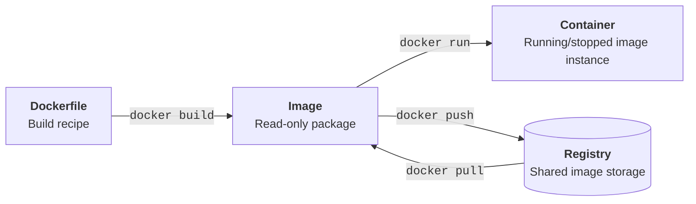

# Docker 101

**Authors:** [Chinmay Samak](https://www.linkedin.com/in/samakchinmay) and [Tanmay Samak](https://www.linkedin.com/in/samaktanmay)

This guide introduces containerization concepts through basic command-line activities. It assumes `docker` is installed and that you can use a terminal.

> **Course context:** Docker can give every student a consistent environment for the simulator, robotics middleware, build dependencies, etc. even when host computers differ.

## Learning goals

By the end of this guide, you should be able to:

- explain images, containers, registries, volumes, and bind mounts;
- run and inspect containers;
- map ports and files between host and container;
- write a basic `Dockerfile`;
- build and tag an image;
- use Docker Compose for a small multi-container setup;
- clean up resources safely.

## Core mental model



- A **Dockerfile** is a recipe for building an image.
- An **image** is a read-only packaged filesystem and configuration.
- A **container** is a running or stopped instance of an image.
- A **registry** stores images; Docker Hub is one example.
- A **volume** stores data managed by Docker.
- A **bind mount** exposes a specific host path inside a container.

A container is not a lightweight virtual machine in every respect. It shares the host's Linux kernel while isolating processes, networking, and filesystems.

## 1. Install and configure Docker

> ![TIP]
> Please refer to the official [Docker installation guide](https://docs.docker.com/get-started/get-docker) for detailed installation instructions.

Verify the installation:

```bash
docker --version
docker compose version
docker info
```

> Membership in the `docker` group effectively grants administrator-level control of the host; treat it as privileged access. Avoid routinely prefixing every Docker command with `sudo` unless that is how your system was intentionally configured.

```bash
docker login -u <YOUR_USERNAME>
```

- Log in with username: Run `docker login -u <YOUR_USERNAME>` (do not use your email address as the username value).
- Web-based authentication: Run `docker login` without flags to use the browser-based device code flow.
- Log out: Run `docker logout` to clear saved credentials from your local configuration.

## 2. Run containers

### Hello world container

```bash
docker run --rm hello-world
```

Docker downloads the image if necessary, creates a container, runs it, and removes the stopped container because of `--rm`.

### Ubuntu 22.04 container

```bash
docker run --rm -it ubuntu:22.04 bash
```

- `--rm` removes the container when it exits.
- `-i` keeps standard input open.
- `-t` provides an interactive terminal.
- `ubuntu:22.04` is the image and tag.
- `bash` replaces the image's default command.

Inside the container, try:

```bash
cat /etc/os-release
pwd
ls
echo "Inside the container" > /tmp/message.txt
cat /tmp/message.txt
exit
```

The `/tmp/message.txt` file disappears when this `--rm` container exits. Container-local changes are not a substitute for persistent storage.

## 3. Container lifecycle

Start a detached container:

```bash
docker run -d --name av-racing-lab ubuntu:22.04 sleep infinity
```

Inspect it:

```bash
docker ps
docker inspect av-racing-lab
```

Open a shell in the running container:

```bash
docker exec -it av-racing-lab bash
```

Type `exit` to leave the shell without stopping the container. Then stop, restart, and remove the container:

```bash
docker stop av-racing-lab
docker ps -a
docker start av-racing-lab
docker stop av-racing-lab
docker rm av-racing-lab
```

> Name your containers with `--name`, such as `av-racing-lab`; they are easier to remember than generated container IDs.

## 4. Images

```bash
docker image ls
docker pull ubuntu:22.04
docker image inspect ubuntu:22.04
```

An image name may include a registry, repository, and tag. Tags such as `22.04` are more reproducible than the moving tag `latest`, but tags can still be updated by publishers. Production workflows may pin an image digest.

Remove a locally unused image by exact name and tag:

```bash
docker image rm ubuntu:22.04
```

> Docker refuses removal of the image if a container still depends on it, unless forced. Avoid force removal while learning.

## 5. Bind mounts

Create lap time data within the project directory on the host:

```bash
cd ~/av-racing-lab
printf "lap,time\n1,42.8\n2,41.9\n" > data/laps.csv
```

Mount the host directory into a container:

```bash
docker run --rm \
  --mount type=bind,source="$PWD/data",target=/data \
  -w /data \
  ubuntu:22.04 \
  cat laps.csv
```

- `--mount type=bind` connects a host directory to a container path.
- `source="$PWD/data"` uses the host's current directory.
- `target=/data` is where it appears in the container.
- `-w /data` sets the container's working directory.

> Changes made through a writable bind mount also change the host files. Add `readonly` when the container only needs to read them:
> ```bash
> docker run --rm \
>   --mount type=bind,source="$PWD/data",target=/data,readonly \
>   ubuntu:22.04 \
>   cat /data/laps.csv
> ```

## 6. Volumes

Volumes represent Docker-managed persistent data. Create a volume using:

```bash
docker volume create race-data
```

Mount the volume to a container, add data, and exit.

```bash
docker run --rm \
  --mount type=volume,source=race-data,target=/data \
  ubuntu:22.04 \
  bash -c 'echo "Winner" > /data/result.txt'
```

Mount the volume to another container, and access the data.

```bash
docker run --rm \
  --mount type=volume,source=race-data,target=/data \
  ubuntu:22.04 \
  cat /data/result.txt
```

Inspect and later remove the volume:

```bash
docker volume inspect race-data
docker volume rm race-data
```

> Removing a volume deletes its stored data. Verify its name and contents first.

## 7. Port mapping

Run a simple web server:

```bash
docker run --rm -d \
  --name nginx-server \
  -p 127.0.0.1:8080:80 \
  nginx:alpine
```

Open `http://localhost:8080` in a browser, or run:

```bash
curl http://localhost:8080
```

The mapping means:

```text
host 127.0.0.1:8080  --->  container port 80
```

Binding to `127.0.0.1` limits access to the local machine. Stop the server:

```bash
docker stop nginx-server
```

Because the container was started with `--rm`, Docker removes it after it stops.

## 8. Build an image with a Dockerfile

Create `~/av-racing-lab/Dockerfile` and open it:

```bash
touch Dockerfile
nano Dockerfile
```

Add this content to the `Dockerfile`:

```dockerfile
FROM python:3.10-slim

WORKDIR /app

COPY lap_summary.py .

CMD ["python", "lap_summary.py"]
```

Create `~/av-racing-lab/lap_summary.py` and open it:

```bash
touch lap_summary.py
nano lap_summary.py
```

Add this content to `lap_summary.py`:

```python
lap_times = [42.8, 41.9, 41.5]
print(f"Fastest lap: {min(lap_times):.1f} s")
```

From `~/av-racing-lab`, build and run it:

```bash
docker build -t av-racing-lap:v0.1.0 .
docker run --name av-racing-lap av-racing-lap:v0.1.0
```

The final `.` is the **build context**: the files Docker may access during the build.

### What each Dockerfile instruction does

| Instruction | Purpose |
|---|---|
| `FROM` | Selects a base image |
| `WORKDIR` | Sets the working directory for following instructions and runtime |
| `COPY` | Copies files from the build context into the image |
| `RUN` | Executes a command while building the image |
| `ENV` | Defines an environment variable |
| `EXPOSE` | Documents an intended container port; it does not publish it |
| `CMD` | Supplies the default runtime command |

### Use a `.dockerignore`

Create `.dockerignore` beside the Dockerfile:

```text
.git
build
logs
*.bag
__pycache__
```

This keeps irrelevant or sensitive files out of the build context. It improves build speed and reduces accidental inclusion.

## 9. Connect to Docker Hub

Pass a runtime setting:

```bash
docker ps -a
docker commit -m "AV-Racing-Lap" -a "AutoDRIVE Ecosystem" <CONTAINER ID> autodriveecosystem/av-racing-lap:v0.1.0
docker login
docker push autodriveecosystem/av-racing-lap:v0.1.0
```

## 10. Environment variables

Pass a runtime setting:

```bash
docker run --rm \
  -e VEHICLE_NAME=neoracer \
  ubuntu:22.04 \
  printenv VEHICLE_NAME
```

> Do not place sensitive information directly in Dockerfiles, image layers, shell history, documentation, or any other files.

## 11. Resource limits

Containers share host resources. Limits help prevent one process from consuming the whole machine:

```bash
docker run --name av-racing-limited \
  --memory=512m \
  --cpus=1.0 \
  ubuntu:22.04 \
  bash -c 'echo "Resource-limited container"'
```

Check the resource utilization and later remove the container:

```bash
docker stats av-racing-limited
docker rm av-racing-limited
```

Hardware and graphical applications need extra configuration:

- GPUs require a compatible host driver and container runtime setup.
- Cameras, serial devices, CAN adapters, and joysticks may require selected `--device` mappings.
- GUI applications require display-server configuration.
- ROS 2 discovery may require deliberate networking configuration.

## 12. Clean up safely

Review resources before removing anything:

```bash
docker ps -a
docker image ls
docker volume ls
docker network ls
docker system df
```

Remove exact, known resources:

```bash
docker rm <CONTAINER_NAME>
docker image rm <IMAGE_NAME>:<TAG>
docker volume rm <VOLUME_NAME>
```

> Prune commands can remove many unused resources at once. Do not run `docker system prune`, especially with `--volumes`, unless you have reviewed what can be deleted and backed up anything important.

## Compact command reference

| Task | Command |
|---|---|
| Run and remove afterward | `docker run --rm <IMAGE>` |
| Run interactively | `docker run --rm -it <IMAGE> bash` |
| List running containers | `docker ps` |
| List all containers | `docker ps -a` |
| Run command in container | `docker exec -it <NAME> bash` |
| Show logs | `docker logs <NAME>` |
| Stop a container | `docker stop <NAME>` |
| Remove a stopped container | `docker rm <NAME>` |
| List images | `docker image ls` |
| Build an image | `docker build -t <NAME>:<TAG> .` |
| List volumes | `docker volume ls` |
| Start Compose project | `docker compose up -d` |
| Stop Compose project | `docker compose down` |
| Show disk use | `docker system df` |

## Common mistakes

- **Confusing image and container**: an image is the template; a container is its instance.
- **Losing data**: store important output in a bind mount or volume, not only in the container layer.
- **Wrong port order**: The correct order is `-p <HOST_PORT>:<CONTAINER_PORT>`.
- **Port already allocated**: stop the conflicting service or choose another host port.
- **Build cannot find a file**: confirm the build context, path spelling, and `.dockerignore`.
- **Permission errors on mounted files**: container user IDs and host ownership may differ.
- **Huge images**: use a suitable base, copy only needed files, and clean package caches in the same build step.
- **Container exits immediately**: containers stop when their main process exits; inspect `docker logs`.

## Further reading

- [Docker documentation](https://docs.docker.com)
- [Docker CLI cheat sheet](https://docs.docker.com/get-started/docker_cheatsheet.pdf)
