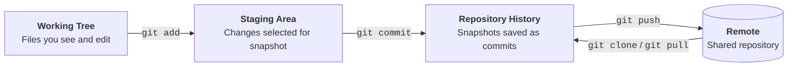

# Git 101

**Authors:** [Chinmay Samak](https://www.linkedin.com/in/samakchinmay) and [Tanmay Samak](https://www.linkedin.com/in/samaktanmay)

This guide introduces version control through basic command-line activities. It assumes `git` is installed and that you can use a terminal.

> [!NOTE]
> **Course context:** autonomous-racing teams use Git to track changes to the autonomy stack, simulation configurations, and documentation. GitHub provides a shared place to review, test, and integrate that work efficiently.

## Learning goals

By the end of this guide, you should be able to:

- create or clone a Git repository;
- understand working-tree, staging-area, and commit states;
- make focused commits;
- inspect history and changes;
- work with branches;
- connect a local repository to GitHub;
- pull and push changes;
- handle merge conflicts safely.

## Core mental model



- The **working tree** is what you currently see and edit.
- The **staging area** is the exact set of changes selected for the next commit.
- A **commit** is a saved snapshot with an author, timestamp, identifier, and message.
- A **remote repository** is a shared copy of the repository on a hosting platform; GitHub is one example.

`git fetch` downloads remote history without changing your working files. `git pull` fetches and then integrates remote changes into your current branch, which may update the working tree.

## 1. Install and configure Git

> [!TIP]
> Please refer to the official [Git installation guide](https://git-scm.com/install) for detailed installation steps.

Verify the installation:

```bash
git --version
```

Configure the name and email recorded in future commits:

```bash
git config --global user.name "Your Name"
git config --global user.email "you@example.com"
git config --global init.defaultBranch main
git config --global --list
```

Use an email associated with your GitHub account if you want GitHub to connect commits to your profile.

## 2. Create a local repository

### Create the project

```bash
cd ~/av-racing-lab
git init
git status
```

- `git init` creates a hidden `.git` directory containing the repository's history and configuration. Do not manually edit that directory.
- `git status` reports your branch and tells you which changes are untracked, modified, or staged.

### Add project files

```bash
printf "# Autonomous Racing Lab\n\nPractice repository for the AuE 4930/6930 course.\n" > README.md
printf "build/\nlogs/\n*.bag\n" > .gitignore
git status
```

`.gitignore` lists intentionally untracked paths. Here, it prevents build outputs, logs, and ROS bag files from being accidentally committed.

> [!WARNING]
> Never commit passwords, API keys, access tokens, or private SSH keys. Adding a secret to `.gitignore` after committing it does not remove it from history.

### Inspect and stage changes

```bash
git diff
git add README.md .gitignore
git status
git diff --staged
```

- `git diff` shows unstaged changes.
- `git add` selects changes for the next commit.
- `git diff --staged` shows the proposed commit.

### Initial commit

```bash
git commit -m "Initialize practice repository"
git log --oneline
```

A useful commit is small, coherent, and described with an imperative message such as `Add steering configuration`.

### Make another commit

```bash
git status
git add config/vehicle.yaml
git commit -m "Add initial vehicle configuration"
git log --oneline --decorate
```

## 3. Inspect and correct changes

Modify the `vehicle.yaml` file:

```bash
printf "max_steering_angle: 0.5236\n" >> config/vehicle.yaml
git diff
```

If the change was unwanted and has not been staged, restore the last committed version:

```bash
git restore config/vehicle.yaml
```

> [!WARNING]
> Use `git restore` carefully: it discards uncommitted changes to the named file.

If a change was staged by mistake, but should remain in the working tree, unstage the change without deleting the edit:

```bash
git restore --staged config/vehicle.yaml
```

## 4. Branches

A branch is a movable name for a line of commits. Use a branch to isolate a feature or experiment.

```bash
git switch -c feature/lap-counter
printf "lap_count: 0\n" > config/race.yaml
git add config/race.yaml
git commit -m "Add race lap counter configuration"
git branch
git switch main
git branch
```

Merge the completed work into `main`:

```bash
git merge feature/lap-counter
```

After verifying the merge, delete the local feature branch:

```bash
git branch -d feature/lap-counter
```

## 5. Connect to GitHub

### Publish the local repository

1. On GitHub, create an empty repository without a README, license, or `.gitignore`.
2. Copy its URL.
3. From `~/av-racing-lab`, run:

```bash
git remote add origin https://github.com/<YOUR-USERNAME>/av-racing-lab.git
git remote -v
git push -u origin main
```

The name `origin` is the conventional nickname for the remote. `-u` connects the local `main` branch to `origin/main`, so later `git push` and `git pull` can omit those names.

> [!TIP]
> - GitHub does not accept your account password for Git command-line HTTPS authentication.
> - Use a browser-based credential helper, a personal access token, SSH, or the GitHub CLI.
> - Read more about GitHub authentication [here](https://docs.github.com/en/authentication/keeping-your-account-and-data-secure/about-authentication-to-github).

> [!TIP]
> You can save your GitHub credentials for future use. Run the following command before `git push` or `git pull` and enter your credentials once:
>
> - On Windows or macOS, you can securely store your credentials indefinitely:
>     ```bash
>     git config --global credential.helper wincred # Windows
>     git config --global credential.helper osxkeychain # macOS
>     ```
>
> - On Linux (or unknown devices), you can cache your credentials in memory for a limited time (e.g., 24 hours):
>     ```bash
>     git config --global credential.helper 'cache --timeout=86400' # Linux, Windows, macOS
>     ```

> [!WARNING]
> - Do not save your credentials on unknown devices.
> - Never share your credentials with anyone.

### Clone the upstream repository

Copy the repository URL from GitHub, then run:

```bash
git clone https://github.com/<ORGANIZATION>/<REPOSITORY>.git
```

Then enter the downloaded directory:

```bash
cd <REPOSITORY>
git remote -v
```


## 6. Everyday collaboration workflow

At the start of a work session:

```bash
git switch main
git pull --ff-only
git switch -c feature/descriptive-name
```

While working:

```bash
git status
git diff
git add path/to/file
git diff --staged
git commit -m "Describe one logical change"
```

Share the branch:

```bash
git push -u origin feature/descriptive-name
```

Then open a pull request on GitHub.

> [!TIP]
> A pull request is a proposal to review and merge one branch into another; it is not itself a commit.

After the pull request is merged, update locally:

```bash
git switch main
git pull --ff-only
git branch -d feature/descriptive-name
```

## 7. Resolve a merge conflict

A conflict occurs when Git cannot safely combine overlapping changes. Git marks the file like this:

```text
<<<<<<< HEAD
max_speed: 6
=======
max_speed: 3
>>>>>>> feature/safe-speed
```

To resolve it:

1. Run `git status` to see conflicted files.
2. Open each file and decide the correct final content.
3. Remove the `<<<<<<<`, `=======`, and `>>>>>>>` marker lines.
4. Test or inspect the result.
5. Stage and commit the resolution.

```bash
git add config/vehicle.yaml
git commit
```

If you want to cancel an in-progress merge and return to the pre-merge state:

```bash
git merge --abort
```

## 8. Useful history commands

```bash
git log --oneline --graph --decorate --all
git show COMMIT_ID
git diff COMMIT_A..COMMIT_B
git blame path/to/file
```

> [!TIP]
> Commit IDs can usually be shortened to an unambiguous prefix shown by `git log --oneline`.

## Compact command reference

| Task | Command |
|---|---|
| Create a repository | `git init` |
| Copy a remote repository | `git clone <URL>` |
| Show current state | `git status` |
| Show unstaged changes | `git diff` |
| Stage selected changes | `git add <FILE>` |
| Show staged changes | `git diff --staged` |
| Save a snapshot | `git commit -m "Message"` |
| Show concise history | `git log --oneline` |
| Create and switch branch | `git switch -c <BRANCH>` |
| Switch branch | `git switch <BRANCH>` |
| Merge a branch | `git merge <BRANCH>` |
| Download remote state | `git fetch` |
| Download and integrate | `git pull` |
| Upload commits | `git push` |
| Show remote URLs | `git remote -v` |

> [!TIP]
> For beginners, `git pull --ff-only` is useful because it stops instead of silently creating a merge commit when histories have diverged.

## Common mistakes

- **Running Git in the wrong directory**: check `pwd`, then `git status`.
- **Using `git add .` without review**: stage specific paths and inspect `git diff --staged`.
- **Committing unwanted data**: update `.gitignore` with the necessary filenames or extensions.
- **A rejected push**: `fetch` or `pull` first and inspect why the histories differ. Do not force-push shared branches.
- **Detached `HEAD`**: create a branch with `git switch -c recovery/my-work` before making more commits.
- **Merge conflict panic**: your committed history remains available. Run `git status`, resolve deliberately, or abort the operation.
- **Deleting work with cleanup commands**: ask for help before using `reset --hard`, `clean -f`, or `push -f`.

## Further reading

- [Git documentation](https://git-scm.com/docs)
- [Git command cheat sheet](https://training.github.com/downloads/github-git-cheat-sheet)
