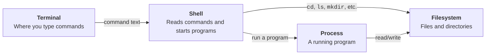

# Linux 101

**Authors:** [Chinmay Samak](https://www.linkedin.com/in/samakchinmay) and [Tanmay Samak](https://www.linkedin.com/in/samaktanmay)

This guide introduces the Linux command line through small, safe activities. It assumes Ubuntu 22.04 and no previous terminal experience.

> **Course context:** autonomous-vehicle projects often run on Linux because robotics tools, simulators, build systems, and embedded-computing workflows are commonly developed for it.

## Learning goals

By the end of this guide, you should be able to:

- navigate the filesystem;
- create, inspect, copy, move, and remove files;
- search for files and text;
- understand paths, permissions, commands, and processes;
- manage packages with `apt`;
- use command history, redirection, and pipes;
- find help when a command is unfamiliar.

## Core mental model



- The **terminal** is the window where you type commands and see output.
- The **shell** is the program that reads your commands; Bash is a common shell on Ubuntu.
- The **filesystem** is the tree of directories and files beginning at `/`.
- A **process** is a program that is currently running.
- Most commands either inspect or change the filesystem, start a process, or connect these ideas together with pipes and redirection.

## 1. Meet the terminal

Open the terminal with `Ctrl`+`Alt`+`T`, or search for **Terminal** in the application menu.

You will see a prompt similar to:

```text
user@computer:~$
```

- `user` is the username.
- `computer` is the machine name.
- `~` means your home directory.
- `$` indicates that the shell is ready for a command.

Here are some commands to begin with:

```bash
lsb_release -a
whoami
pwd
```

- `lsb_release -a` prints clean distribution details.
- `whoami` prints your username.
- `pwd` means **print working directory** and shows your current location.

### Important habits

- Linux is case-sensitive: `Data.csv` and `data.csv` are different files.
- Press `Tab` to complete file and command names.
- Press the up/down arrows to browse command history.
- Press `Ctrl`+`C` to stop a command that is running in the foreground.
- Do not use `sudo` unless you understand why administrator access is needed.
- Read removal commands carefully. Files deleted with `rm` may not go to the Trash.

## 2. Understand the filesystem

Linux organizes files in a tree beginning at `/`, called the root directory.

```text
/
├── home/       users' personal files
├── etc/        system configuration
├── tmp/        temporary files
├── usr/        installed programs and shared data
└── var/        logs and changing application data
```

Your home directory is usually `/home/username`. The symbol `~` is a shortcut for it.

### Absolute and relative paths

- An **absolute path** begins at `/`, such as `/home/user/project`.
- A **relative path** begins at your current directory, such as `project/data`.
- `.` means the current directory.
- `..` means the parent directory.

### Create and enter a directory

```bash
cd ~
mkdir -p av-racing-lab/{config,data,logs,scripts}
cd av-racing-lab
pwd
```

- `cd` changes directory.
- `mkdir -p` creates the named directory and any needed parent directories. Braces, `{}`, create several sibling directories at once.

### List its contents

```bash
ls
ls -l
ls -la
```

- `-l` shows details such as permissions, owner, size, and modification time.
- `-a` includes hidden entries, whose names begin with `.`.
- Options can be combined: `-la`.

### Create and inspect files

```bash
touch config/vehicle.yaml
printf "vehicle_name: neoracer\nmax_speed: 6\n" > config/vehicle.yaml
cat config/vehicle.yaml
```

- `touch` creates an empty file or updates its timestamp.
- `printf` prints formatted text.
- `>` redirects output into a file, replacing its previous contents.
- `cat` prints a file to the terminal.

Append a line without replacing the file:

```bash
printf "wheelbase: 0.28\n" >> config/vehicle.yaml
cat config/vehicle.yaml
```

`>>` appends output. Confusing `>` and `>>` is a common source of lost content.

### Copy, rename, and move files

```bash
cp config/vehicle.yaml config/vehicle-backup.yaml
mv config/vehicle-backup.yaml config/vehicle-safe.yaml
cp config/vehicle.yaml .
mv vehicle.yaml data/
ls -R
```

- `cp <SOURCE> <DESTINATION>` copies.
- `mv <SOURCE> <DESTINATION>` moves (or renames).
- `ls -R` lists directories recursively.

### Read files comfortably

For a quick read-only view with scrolling and search, use `less`:

```bash
less config/vehicle.yaml
```

Inside `less`, use arrow keys to move, `/<WORD>` to search, and `q` to quit.

Linux has many viewers and editors. A **viewer** is safest when you only need to inspect a file; an **editor** can edit/change it.

| Tool | Type | Availability | Remarks |
|---|---|---|---|
| `cat` | Viewer | Installed by default | Prints a whole file immediately. Best for short files; long files may scroll off screen. |
| `head` / `tail` | Viewers | Installed by default | Show the beginning or end of a file. `tail -f <FILE>` follows a log as new lines are written. |
| `less` | Viewer | Normally installed | Scrolls through large files without loading them into an editor. It supports forward search with `/`, backward search with `?`, and does not modify the file. |
| `nano` | Terminal editor | Normally installed on standard Ubuntu installations | Beginner-friendly: important shortcuts appear at the bottom of the screen. It supports search, cut/paste, and basic syntax coloring. |
| `vim` | Terminal editor | Full Vim is not installed by default. Some installations include the limited `vim-tiny` as `vi`. | Fast and highly configurable, with syntax highlighting, powerful navigation, macros, split windows, and plugins. Its modal controls have a steeper learning curve. |
| `gedit` | Graphical editor | Normally installed on a full Ubuntu Desktop; usually absent from Server and minimal installations | Familiar mouse-and-menu interface with tabs, undo, search/replace, line numbers, and syntax highlighting. It requires a graphical desktop session. |

### Search

Find `YAML` files under the current directory:

```bash
find . -type f -name "*.yaml"
```

Find lines containing `speed`:

```bash
grep -Rni "speed" .
```

- `-R` searches recursively.
- `-n` shows line numbers.
- `-i` ignores letter case.

### Use pipes

A pipe, `|`, sends the output of one command into another:

```bash
find . -type f | sort
grep -Rni "speed" . | less
```

This lets small commands work together. Read a pipeline from left to right.

### Remove a file

First inspect the exact target, then remove it:

```bash
ls -l data/vehicle.yaml
rm -i data/vehicle.yaml
```

The `-i` option asks for confirmation. Use `y` to confirm, or `n` to cancel.

To remove an empty directory, use `rmdir <DIR_NAME>`.

> Avoid copying commands such as `rm -rf` until you fully understand the target. Here, `-r` recursively removes directories and `-f` forces confirmation.

## 3. Edit text in the terminal

Ubuntu commonly includes `nano`, a beginner-friendly terminal editor:

```bash
nano scripts/lap_summary.sh
```

Add the following content to the file:

```bash
#!/usr/bin/env bash
echo "Lap summary ready"
```

Press `Ctrl`+`O`, `Enter` to save, and `Ctrl`+`X` to exit.

## 4. Manage permissions

Check current permission flags:

```bash
ls -l scripts/lap_summary.sh
```

You may see permissions such as `-rwxr-xr-x`:

- the first character describes the item type (`-` file, `d` directory);
- the next three characters apply to the owner;
- the next three apply to the group;
- the final three apply to everyone else;
- `r`, `w`, and `x` mean read, write, and execute.

Grant or revoke permissions:

```bash
chmod u+x scripts/lap_summary.sh
chmod go-w config/vehicle.yaml
```

- `u+x` adds execute permission for the owner.
- `go-w` removes write permission from the group and others.

You can now execute the script to which you granted the `x` permission.

```bash
./scripts/lap_summary.sh
```

`./` tells the shell to run a program from the current directory. Linux does not search the current directory automatically.

## 5. Manage packages

Ubuntu uses the Advanced Package Tool (APT) package manager. Updating package information and installing software requires administrator access:

```bash
sudo apt update
sudo apt upgrade
```

- `sudo` runs commands with elevated privileges and may ask for your password. Nothing appears while you type the password; this is normal.
- `apt update` refreshes the local list of available packages and their versions.
- `apt upgrade` actually downloads and installs the newer software versions.

```bash
sudo apt install tree
```

## 6. Manage processes

Start a harmless background process:

```bash
sleep 300 &
jobs
```

The `&` runs it in the background.

Show matching processes and stop the one you started:

```bash
pgrep -a sleep
kill %1
jobs
```

Use `top` for a live process view; press `q` to quit. `ps aux` prints a snapshot.

## 7. Getting help

```bash
man cp
cp --help
apropos "copy files"
```

In a manual page, press `/` to search and `q` to quit. A good habit is to inspect a command's help before using unfamiliar commands or options.

## Compact command reference

| Task | Command |
|---|---|
| Show current directory | `pwd` |
| List files | `ls` |
| Change directory | `cd <PATH>` |
| Go home | `cd ~` |
| Go up one level | `cd ..` |
| Create a directory | `mkdir <NAME>` |
| Create an empty file | `touch <FILE>` |
| Print a file | `cat <FILE>` |
| Copy | `cp <SOURCE> <DESTINATION>` |
| Move (or rename) | `mv <SOURCE> <DESTINATION>` |
| Remove with confirmation | `rm -i <FILE>` |
| Search filenames | `find <PATH> -name "pattern"` |
| Search file contents | `grep -Rni "text" <PATH>` |
| Clear the terminal | `clear` or `Ctrl`+`L` |
| Show command history | `history` |
| Stop a foreground command | `Ctrl`+`C` |

## Common mistakes

- **`command not found`**: check spelling, installation, and capitalization.
- **`No such file or directory`**: run `pwd` and `ls`; verify the path.
- **`Permission denied`**: inspect `ls -l`; do not carelessly add `sudo`.
- **Spaces in names**: quote the path, e.g., `cd "My Project"`; or use backslash, e.g., `cd My\ Project`.
- **A terminal seems frozen**: you may be inside `less`, `man`, or another program. Try `q`; otherwise try `Ctrl`+`C`.
- **A script will not run**: check its execute permission and run it as `./script.sh`.

## Further reading

- [The Linux command line for beginners](https://documentation.ubuntu.com/desktop/en/latest/tutorial/the-linux-command-line-for-beginners/)
- [Ubuntu CLI cheat sheet](https://assets.ubuntu.com/v1/d00791ae-ubuntu_cli_cheat_sheet_2025.pdf)
